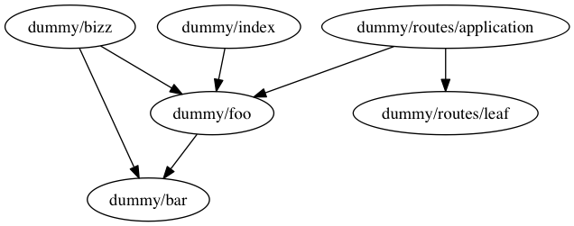
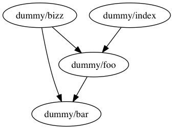

# FS Graph Diff

The purpose of this module is to return a list of files in a retained dependency graph.

Given:

```
dummy/index.js
dummy/foo.js
dummy/bar.js
dummy/bizz.js
dummy/routes/application.js
dummy/routes/leaf.js
```

Parse all of the files in the list and return the connected graph:

```
"dummy/bizz" -> "dummy/bar"
"dummy/bizz" -> "dummy/foo"
"dummy/foo" -> "dummy/bar"
"dummy/index" -> "dummy/foo"
"dummy/routes/application" -> "dummy/foo"
"dummy/routes/application" -> "dummy/routes/leaf"
```



If the files list then becomes:

```
dummy/index.js
dummy/foo.js
dummy/bar.js
dummy/bizz.js
```

The graph should detect that the files were removed and re-resolve the graph giving you:

```
"dummy/bizz" -> "dummy/bar"
"dummy/bizz" -> "dummy/foo"
"dummy/foo" -> "dummy/bar"
"dummy/index" -> "dummy/foo"
```


